## General Overview

SonaVu™… Powered by SDT Ultrasound Solutions, is a multi-frequency acoustic imaging camera that takes airborne ultrasound inspection to a new level.  Equipped with 112 highly sensitive sonic sensors and a precision optical camera, SonaVu™ brings the power of super-human hearing to focus on its vibrant, color touch screen. It unlocks limitless applications for asset reliability, energy conservation, and safety including compressed air leak management, electrical asset reliability, and much more.

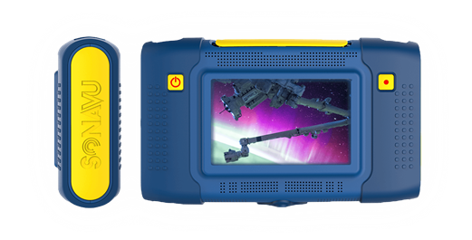

Within these pages you can find information about the safe operation of your SonaVu™ acoustic imaging camera as well as resources on caring for the product so that you may enjoy its benefits for many years. 

## Product Configuration

SonaVu™ is available in two configurations. SonaVu™ BASE and SonaVu™ PRO:

### SonaVu™ BASE

| Qty | Article Code | Description |
| --- | --- | --- |
|  | FS.SVU.STN.001 | SDT SonaVu Base Kit |
| 1 | FU.SVU.001-01 | SonaVu Acoustic Imaging Camera w/ Hand Strap and Rubber Grip |
| 1 | FU.SVU.PWR.001 | SonaVu Power Supply w/ Adapters |
| 1 | FU.SVU.CLN.001 | SonaVu Cleaning Kit |
| 1 | FU.CA930.CBOX.001-01 | SDT930 Custom Carrying Case |
 
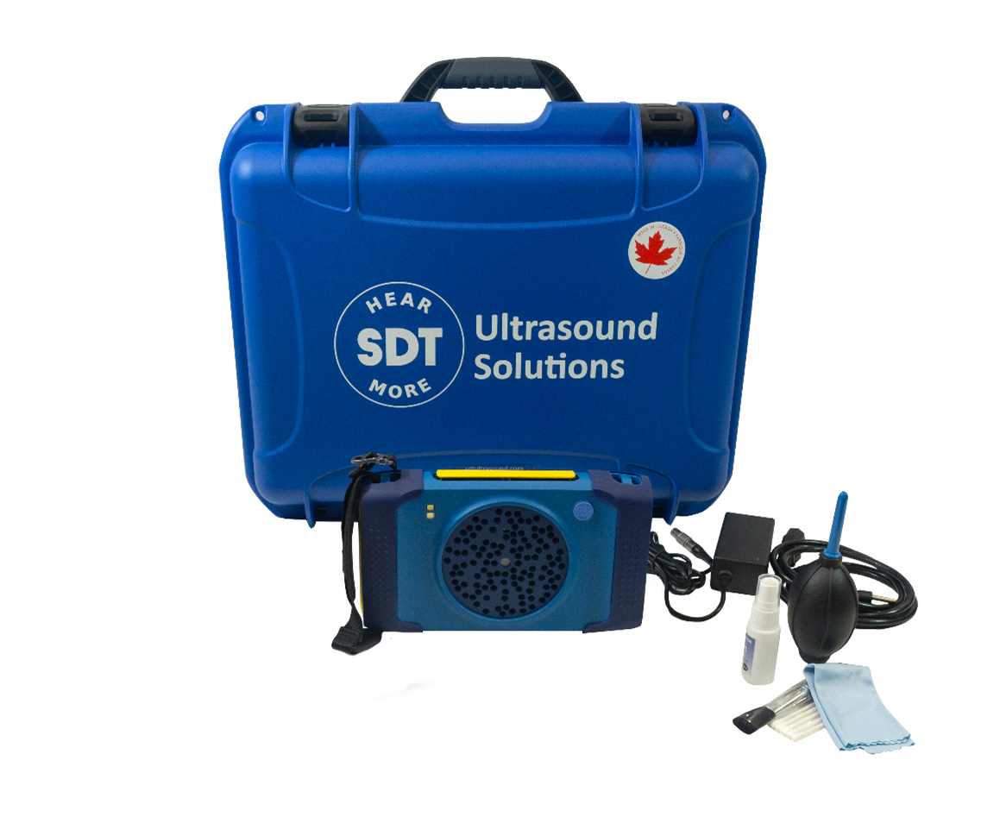

### SonaVu™ PRO

| Qty | Article Code | Description |
| --- | --- | --- |
|  | FS.SVU.PRO.001 | SDT SonaVu Pro Kit |
| 1 | FU.SVU.001-01 | SonaVu Acoustic Imaging Camera w/ Hand Strap and Rubber Grip |
| 1 | FU.SVU.PWR.001 | SonaVu Power Supply w/ Adapters |
| 1 | FU.SVU.CLN.001 | SonaVu Cleaning Kit |
| 1 | FU.HDPH.ADT.001 | Headphone Adapter, 1/4" to 1/8" |
| 1 | FU.LKC.001-01 | SDT LEAKChecker Receiver w/ 16mm Tip |
| 1 | SIBAT1,5VALK-AA | Battery Alkaline 1,5V AA, 2 Pack |
| 1 | SIRUBSENS18MMSI | Rubber Tip |
| 1 | FUHDPH-21 | Headphones, Neckband |
| 1 | SICABUSBAUSBBM | USB Cable |
| 1 | FUTOOLSCRDRIV | Screwdriver for Battery Cover |
| 1 | FU.CA930.CBOX.001-01 | SDT930 Custom Carrying Case |

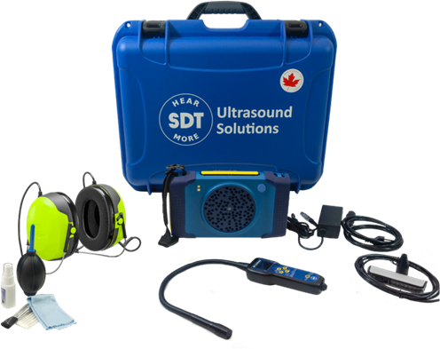

## Hardware Features and Configuration

SonaVu™ was designed with efficiency, ergonomics and simplicity as the top priorities. The table below describes the main features of the instrument and illustrates where they are located. 

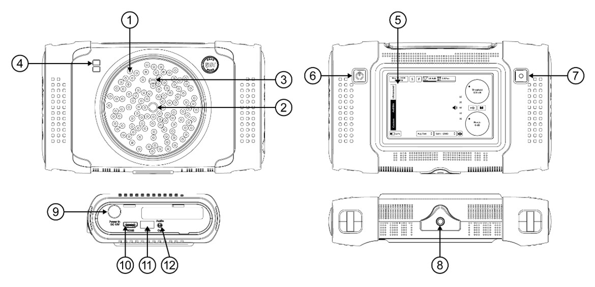

| ID | Name | Description | Quantity |
| --- | --- | --- | --- |
| 1 | Microphone/Sensor | Ultrasound sensor array | 112 |
| 2 | Camera | Camera to capture both still and video | 	1 |
| 3 | Distance Sensor | Sensor measures distance from source to sensor | 1 |
| 4 | Dual Light | LED lighting for using SonaVu™ in dark situations | 2 |
| 5 | 5” LCD Screen | 5” colour touch display (800x480 resolution) | 1 |
| 6 | Power Button | Hold for 3 seconds to power SonaVu™ on/off | 1 |
| 7 | Record Button | To capture images and record video | 1 |
| 8 | Tripod Mount | Threaded insert to fix SonaVu™ to a tripod | 1 |
| 9 | Charging Port | For connecting SonaVu™ to battery charger or supplemental battery supply | 1 |
| 10 | HDMI | Connect SonaVu™ to external display/projector | 1 |
| 11 | USB Port | Export images/video; Upgrade/Update firmware | 1 |
| 12 | Audio Jack | 1/8” audio jack. Live listen to SonaVu™ sounds | 1 |
 
## Operation
### Connection Port Overview

All connection ports are located on the left side of the device under the yellow rubber SonaVu protective cover. Open the cover from the top while the screen is facing you.  The side cover is hinged at the bottom.

| 1 | Power Port | LEMO Power Connector for DC power supply |
| --- | --- | --- |
| 2 | Video Port | HDMI port for video output to external display |
| 3 | USB Port | USB 2.0 for transferring data and updating device firmware |
| 4 | Audio Jack | Standard 1/8” audio jack for headphones or external speaker |

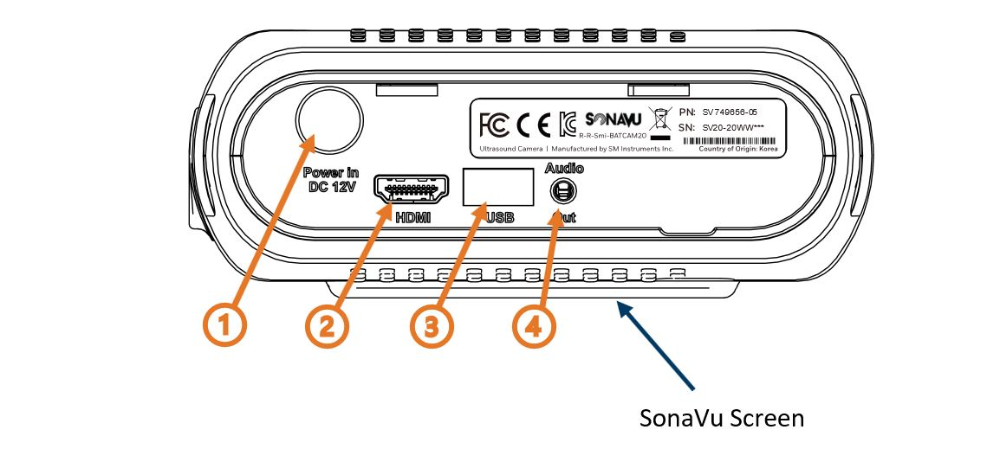

### Connecting the Charger/Power Adaptor

Connect the LEMO cable by aligning the red dot on the LEMO connector with the red dot on the power port on the side of the device.
 

OR

 
### Status Indicator Lights

Power Status Indicator (1)
After powering ON the SonaVu™, a Green LED indicator will light on the top left corner of the casing.
Charging Status Indicator (2)
When the power adapter is connected the SonaVu™ will automatically start charging the internal battery and a Red LED indicator will light on the top right corner. 
A Red LED light indicates the device is charging.	

A Green LED light indicates the device is fully charged.	

 
### External Interface Connections

①	HDMI Port

The SonaVu™ can be connected to an external monitor with an HDMI cable.

②	USB Port
Image and video files stored in SonaVu™ can be transferred to a USB drive (FAT 32 format) via the USB port. 

To copy data*: 

Connect the USB memory device to the USB port located on the left. 

Connect the USB memory device and press the USB icon on the right side of the SonaVu™ main screen.

*The amount of time that is transferred may vary depending on the number and capacity of the files stored. (There is no USB memory device available on the device.)*

### Bluetooth Setup

1.	Press the Blueooth button on the bottom left of the screen to enter the Bluetooth Setup screen:

2.	Make sure Bluetooth is enabled ( the switch on the top right is on):

3.	Press the Scan button on the Sonavu and the Pair button on your Bluetooth device. Look for the Bluetooth device to show under the New Devices section: 

4.	Select the new device by touching the Text and then press the Connect button on the right part of the screen

5.	It can take a minute for the device to pair and then the name will move up the Paired Devices section.

#### Disconnecting a Paired Device
Disconnecting a paired device breaks the Bluetooth connection but keeps the device in the list of Paired Devices. This allows you to switch to a different device without having to go through the whole setup process again.
From the Bluetooth setup screen, select the device to break the connection with and press the Disconnect button on the right part of the screen.

#### Removing a Paired Device

Removing a paired device makes the SonaVu forget the connection to the selected Bluetooth device. Use this option if you’ve had troubles pairing the device and need to re-connect the device.
From the Bluetooth setup screen, select the Paired device you want to remove and press the Remove button on the right part of the screen.

 

### Using the Power Button

Press the power button on the left side and hold for 2 seconds to power the SonaVuTM on. The green  LED power status indicator on the top left side of the device will light. 
To turn off the power, press the power button again and hold for 2 seconds. The green LED power status indicator lamp will turn off.
1. **Power ON**   When powered on, the company logo ('SDT') and product logo ('SonaVu’) appear in order on the LCD screen while the device boots.
2. **Power OFF**   When you turn off the power, the product logo (‘SonaVu’) appears on the LCD screen until the power shuts down.

 

### Using the Record Button
The Record button allows you to save the screen you are measuring as an image (JPG) or a video (AVI). 

 

1.	**Save Image**   A short press of the Record button saves the screen you are measuring as an image (JPG format). The saved images can be viewed by clicking the library icon on the right side of the main screen.
              
 

2.	**Save Video**   Press and hold the Record button for 2 seconds to start recording video (AVI format). A flashing red icon will appear at the top right of the screen to indicate that you are recording. Press and hold the record button for 2 seconds to stop recording ( video is automatically saved ). The saved videos can be viewed by clicking the library icon on the right side of the main screen. 

 
 
### Using the Light Feature
The light icon on the top of the screen allows you to activate two lights mounted on the front of the device. Pressing the icon toggles the light on or off.
The lights aid in brightening dark areas and make it easier to capture images and video.

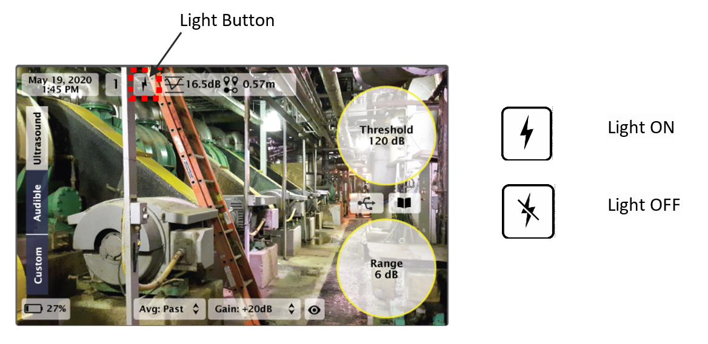 

## SonaVu™ Firmware
### Main Screen (User Interface)

The main screen for the SonaVu™ software is shown below. Users can set and view various measurements parameters on the main screen without having to connect to a PC.

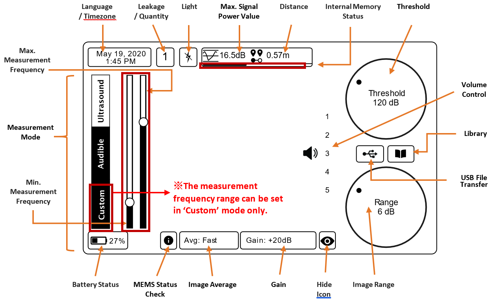 

**Signal Power Settings**
- Threshold (display reference value)
- Image Range
- Image Average 

**Measurement Environment Settings**
- Measurement mode
- Distance (Source to SonaVu™)
- Gain 
- Max Signal Power

**System Settings**
- Language/Time Zone
- Hide Icon
- USB Transfer
- Library (Check/Delete Files)
- Battery Status
- Internal Memory Status

### Icon Functions
At the top left of the main screen a total of four icons are shown, each icon's function, definition, and description are shown in the table below.

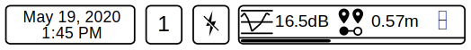 

| Icon | Function | Description |
| --- | --- | --- |
| 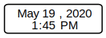  | Language/Timezone Check and Setting | Displays the current date/time. To change the language or the Time Zone press and hold the icon:  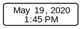  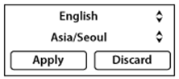 Touch the arrows in the red box to select the language/time zone you want  *Languages: Korean, English, Chinese and French*  *Time zone: Support for all countries*  Press 'Apply' to save the changes.  Press ‘Discard’ to cancel the changes. |
|  | Leak Strength Index | Indicates the estimated strength of the Leak:<ol><li>Less than 200cc/m</li><li>Excess 200 Less than 400cc/m</li><li>Excess 400 ~ Less than 600cc/m</li><li>Excess 600 ~ Less than 800cc/m</li><li>More than 800cc/m</li></ol> |
|  | Light ON/OFF | Press the icon to toggle the light on or off on the front of the device. 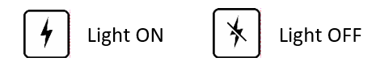 |
| 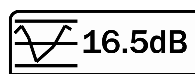 | Signal Indicator | Displays the current signal level of the sound being measured. Signal Power is the rainbow color scheme on the measurement screen, which indicates the amount of sound pressure being measured. |

